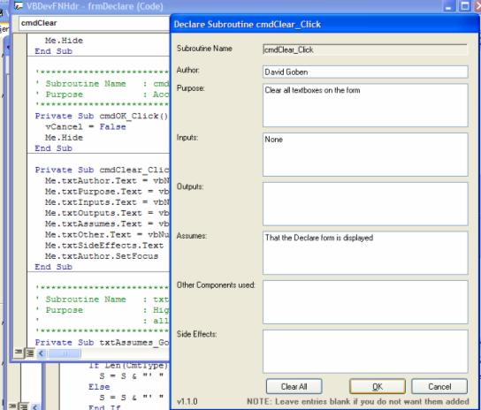



## Add VB Procedure Headers

### Description

Updated. Version 1.1.1 (fixed ignore of Friend Properties). This VB Add-In allows E-Z formatting of Procedure headings. I wrote this because of the laziness of fellow developers who saw no sense in taking the time to AT LEAST document a Subroutine or Function or Property (until 6 months down the road when they wish they had).

The Original incarnation of this program was grabbed from the web years and years and years ago (back when I was a “baby” VB developer). I have fleshed it out with a lot of new functionality, simplified a lot of procedures, and cleaned up the code. I wish I could remember who had originally posted the original incarnation of this useful utility.

Anyway, it makes a great beginner project. I did this back in '98 when I was first learning VB (I came over from C++ and Fortran). Oh, since I'm a C++ developer, let me tell you about my fellow bozos who stick their nose up at VB: Once I realized I could write an application in VB in a day that would take me close to a month to do in C++, I became an instant VB convert.
 
### More Info
 

             |
---                |---
**Submitted On**   |2004-02-19 10:51:14
**By**             |[David Ross Goben](https://github.com/Planet-Source-Code/PSCIndex/blob/master/ByAuthor/david-ross-goben.md)
**Level**          |Intermediate
**User Rating**    |4.7 (47 globes from 10 users)
**Compatibility**  |VB 6\.0
**Category**       |[Miscellaneous](https://github.com/Planet-Source-Code/PSCIndex/blob/master/ByCategory/miscellaneous__1-1.md)
**World**          |[Visual Basic](https://github.com/Planet-Source-Code/PSCIndex/blob/master/ByWorld/visual-basic.md)
**Archive File**   |[Add\_VB\_Pro1710792192004\.zip](https://github.com/Planet-Source-Code/david-ross-goben-add-vb-procedure-headers__1-51774/archive/master.zip)

